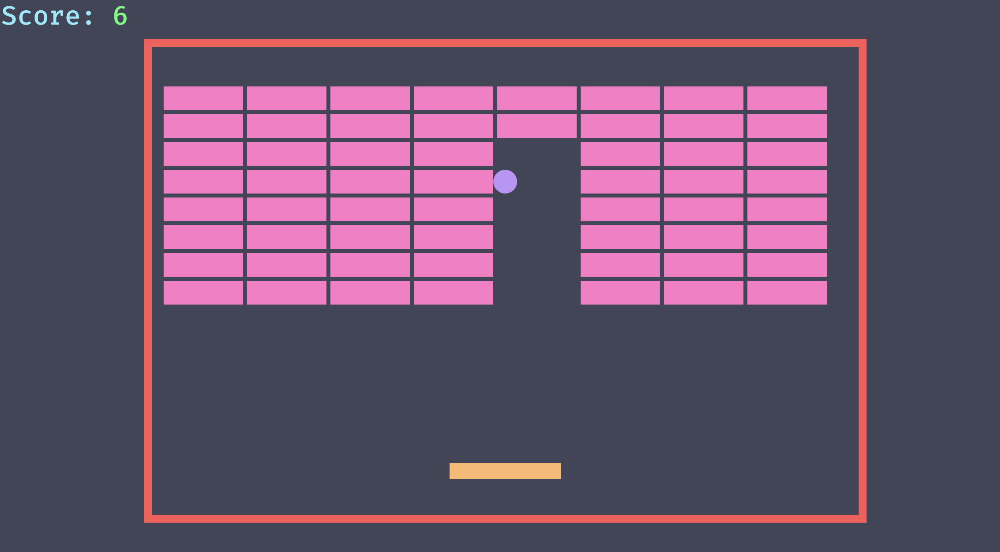

<p align="center">
  
</p>

# Bevy Breakout

**A [Breakout](<https://en.wikipedia.org/wiki/Breakout_(video_game)>) game with Bevy game engine**.

This is for educational-purposes, to learn more about Bevy and Rust in general.

## Setup

Clone the repository, and then install the packages:

```sh
cargo install
```

Run the game with:

```sh
cargo run

# alternative for a bit faster launch
cargo run --features bevy/dynamic_linking
```

Lint usin Clippy:

```sh
cargo clippy
```

## Layout

Everything is a plugin in their respective files, and thanks to that the `main` function looks like:

```rs
fn main() {
    App::new()
        .add_plugins(DefaultPlugins)
        .add_plugins(GamePlugin)
        .add_plugins(ScoreboardPlugin)
        .add_plugins(PhysicsPlugin)
        .add_plugins(PaddlePlugin)
        .add_plugins(WallPlugin)
        .add_plugins(BallPlugin)
        .add_plugins(BricksPlugin)
        .run();
}
```

# Assets

Here are free websites to design assets:

- https://sfxr.me/ to make 8-bit or 16-bit sounds.
- https://www.piskelapp.com/ to design sprites.

## Resources

- The starter code is written via [this video](https://www.youtube.com/watch?v=E9SzRc9HkOg) from [this repository](https://github.com/c-gamedev/bevy-breakout).
- [This](https://www.youtube.com/watch?v=B6ZFuYYZCSY) is also a great Bevy tutorial.
- Here is a nice [template](https://github.com/NiklasEi/bevy_game_template) as well.
